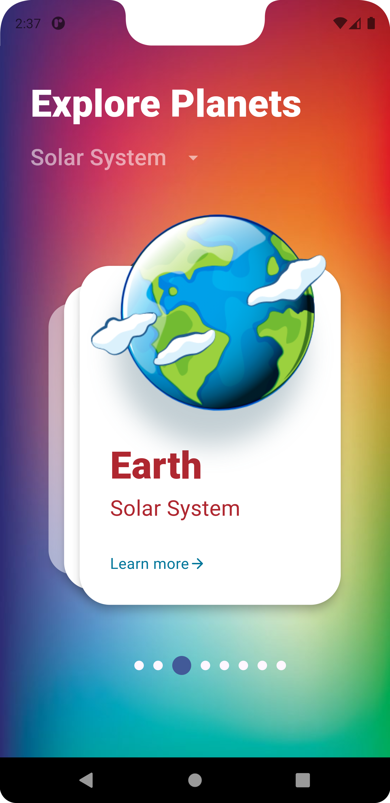

# PlanetsExplorer

##Project overview

PlanetsExplorer is a project that allows users to explore and learn about different planets in our solar system. The app provides detailed information and images for each planet, making it an engaging and educational tool for astronomy enthusiasts.

## Features

- **Homepage**: Displays an overview of all planets with images and basic information.
- **Planet Details**: Offers detailed information and images of each planet, including Earth, Mars, Jupiter, Saturn, Mercury, Venus, Neptune, and Uranus.
- **Interactive**: Explore planets with detailed views and images.

## Usage

To explore planets using the app:
1. **Launch the App**: Open the PlanetsExplorer application.
2. **Navigate to the Homepage**: View all available planets with basic information.
3. **Select a Planet**: Click on a planet to view detailed information and images.
4. **Explore Details**: Use the interactive features to learn more about the selected planet.

## Screenshots

### Homepage and Detail Pages

| Homepage | Detail Page Earth | Detail Page Earth Suite |
|----------|--------------------|-------------------------|
|  |  |  |

### Planet Exploration

| Mercury | Venus | Mars | Jupiter | Saturn | Uranus | Neptune |
|---------|-------|------|---------|--------|--------|---------|
|  |  |  |  |  |  |  |

